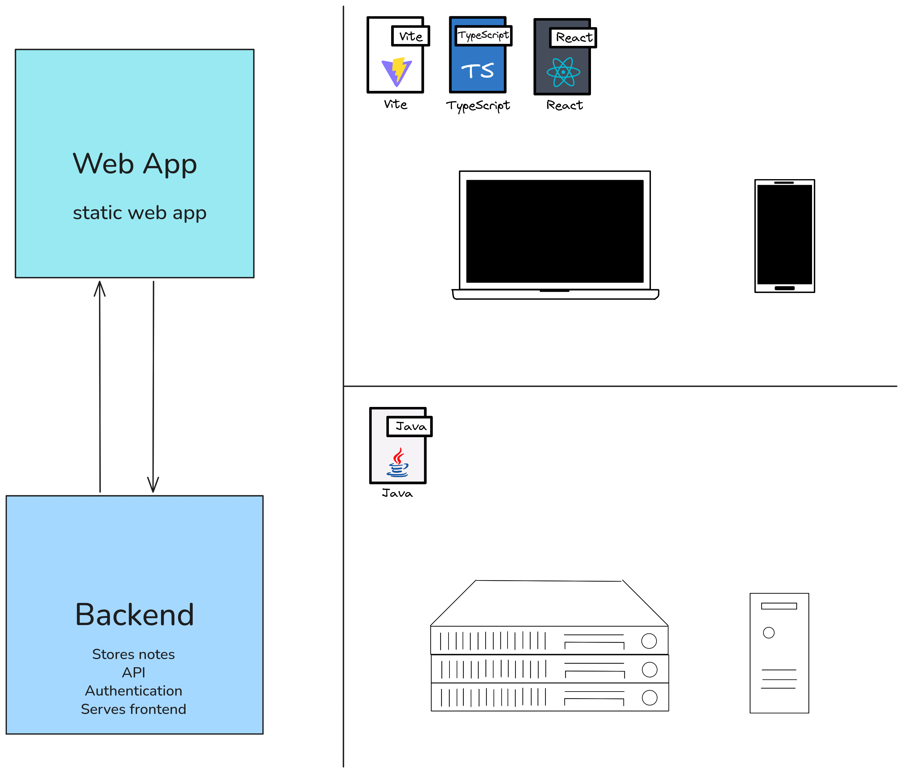

# chalk


Minimalist note taking app

## Live Demo

TBA

## Usage

Prerequisites:

* NodeJS 24
* Java 17

### Development

1. Clone the repository
   
    ```bash
    git clone https://github.com/michael-m-2983/chalk.git
    cd chalk
    ```

2. Build the frontend

    ```bash
    cd chalk-frontend
    npm install
    npm run build
    cd ..
    ```

3. Start the backend

    ```bash
    cd chalk-backend
    ./gradlew run
    ```

4. Visit <http://localhost:8080>

## Architecture

